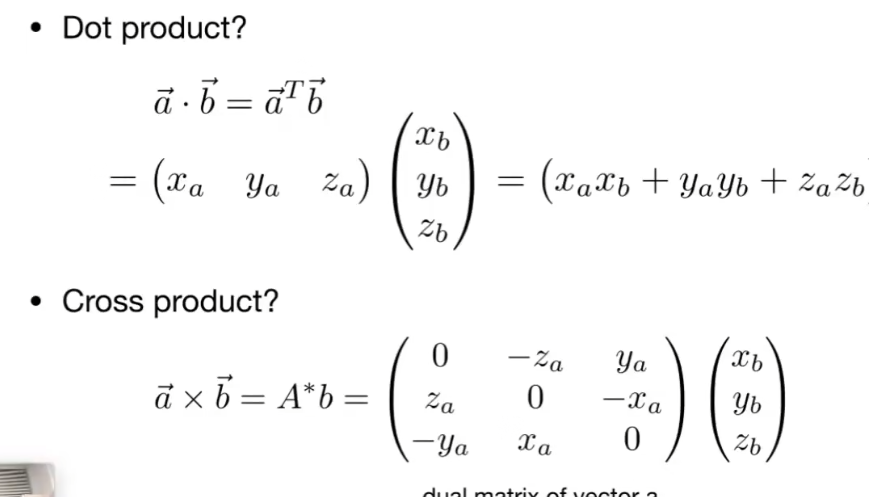

## 向量Vectors

### 1. 单位向量

长度为1的向量就是单位向量

### 2. 向量的基本操作

最普通的操作就是向量相加

### 3. 直接坐标系下的向量

将向量开始的位置设置为原点，x，y表示响应的单位向量

我们可以直接使用数来表示一个向量，向量的长度也很容易算出

### 4. 向量的乘法

- 点乘
- 叉乘

#### 4.1 点乘 dot product

**点乘的作用**

- 点乘可以快速得到两个向量的夹角为多少！！！！尤其是在使用单位向量的时候，$con\theta$就是两个向量相乘
- 另一个作用是找到一个向量映射到另一个向量上的值
- 两个向量是否靠近
- 事务前与后的区别

##### 点乘的运算法则

##### 在直接坐标系中向量的乘法

##### 点乘还可以判断事物的方向

a,b的点乘是大于0的，而a,c的点乘是小于0的

##### 向量的映射

将b投影到a上

**投影的作用**

可以将一个向量分解为两个向量

#### 4.2 叉乘

叉乘的结果是一个垂直与ab的线，遵循右手定则

叉乘的顺序不可交换！！！交换顺序需要加上负号

作用：根据x,y两个轴可以算出z轴的位置

叉乘自己的结果是一个零向量

**代数计算**

##### 叉乘的作用

- 判定左和右
- 判定内和外

- 对于左边的图

b很明显在a的左边，此时a，b的叉乘的结果正的，相反如果是负的则是在右边

- 对于右边的图

p在三角形内部，此时p在ab的左侧，同理可以判断p在bc的左侧，ac同理。都在边的左侧，那么p就是在abc的内部

可以看到只要按照同一个顺序进行叉乘，如果所有的符号相同则在内部！！！！

## 矩阵 matrix

操作：矩阵的乘法

### 1. 矩阵乘法的规则

### 2. 一些概念

单位矩阵。。。。

矩阵的转置。。。。

#### 点乘和叉乘可以转变为矩阵的乘法

