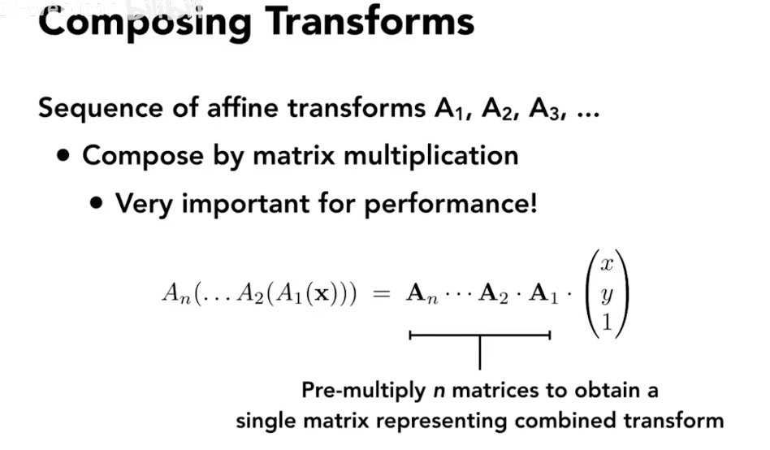

# transformation

### Scale

缩放变换

这就是一个缩放矩阵

如果x,y方向是不规则缩放

### Reflection Matric

### Shear Matrix切变

### Rotate 旋转

一般都是原点旋转，一般都是逆时针旋转

## Linear transforms = Matrices(if the same dimension)

**线性变换**

## 齐次坐标

在平移变换中

## 解决方法

为了解决平移变换中，方式不一样的问题，我们添加了一个维度

但是我们需要区分点的平移和向量的平移：向量的平移不改变向量的！！！！

- vector + vector = vector
- point - point = vector
- point + vector = point
- point + point = ??

point + point 就是这两个点的中点！！！

$x` = {x_1+x_2 \over 2}  $

## 反射变换

## 逆变换

## 组合变换

变换的顺序是不是改变的

## 分解变换

**如果不是在原点旋转**

## 3D变换

3的变换也可以多加上一维

答案：先进行线性变换，再进行平移同2D

>

## 补充

