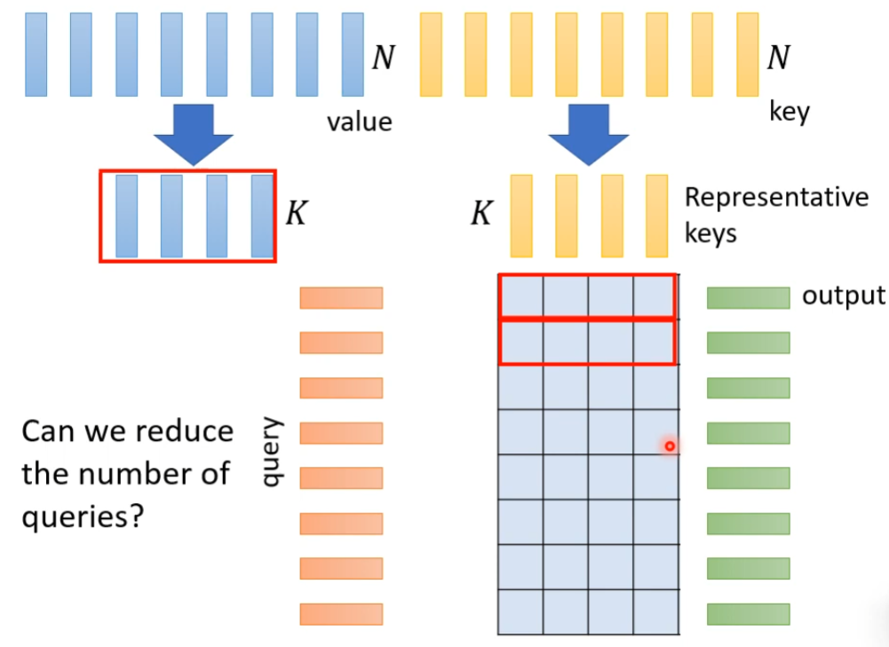

## 1. local attention/ Truncated attention

如果我们的关注点只在一定的范围内，比如前后两边，我们可以缩减矩阵

## 2. Stride attention

## 3. global attention

我们可以添加一些特殊的token作为全局token

- attend to every token -> collect global information
- attended by evert token -> it knows global information

有两种方法，1. 选择原本就有的token作为global 2.外插一些作为global token

> 我们可以使用多头技术，混合的使用之前的技术
>
> 

## 4. focus on critical part---Clustering

如果某些位置的分数比较低，我们可以直接将它设置为0

我们只计算同一个位置的query和key，其他设为0

## 5. 机器自己确定

## 6. Linformer

