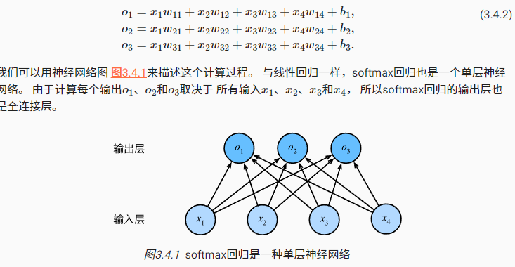

## 1. 分类问题

如何表示一个多分类问题的类别，直接的想法是{1,2,3}但是有一种更加简单的方法：one-hot encoding: (1,0,0),(0,1,0),(0,0,1)
$$
y \in \left\{ (1,0,0),(0,1,0),(0,0,1)  \right \}
$$

## 2. 网络架构

多分类问题，n个种类，对应n个输出也就是$o_1,o_2,o_3$

## 3. softmax计算

为了得到预测的结果，我们将设置一个阈值来选择最大概率的标签。

我们不能直接将o的输出作为我们的结果：一方面：输出的数字的和不为1，利益方面输出的可能是负值，此处我们使用softmax函数
$$
\hat{y_j} = {\exp(o_j) \over \sum_k\exp(o_k)}
$$
因为使用了指数，保证了非负，同时确保了输出值之和为1

## 4. 小批量样本矢量化

## 5. 交叉熵损失

## 6. softmax和导数

https://zh.d2l.ai/chapter_linear-networks/softmax-regression.html

> 本章设计很多知识，推荐阅读花书，进行复习