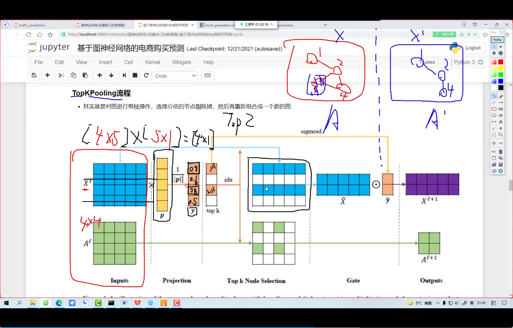

# 构建自己的图数据集


```python
import torch
from torch_geometric.data import Data 
# 节点的特征详细
x = torch.tensor([[2, 1], [5, 6], [3, 7], [12, 0]], dtype=torch.float)
# 节点的标签
y = torch.tensor([0, 1, 0, 1], dtype=torch.float)
# 边
edge_index = torch.tensor([[0, 1, 2, 0, 3],
                           [1, 0, 1, 3, 2]],dtype=torch.long)
data = Data(x=x,y=y,edge_index=edge_index)
```

https://www.bilibili.com/video/BV1Em4y1A7Vm?p=19&vd_source=8beb74be6b19124f110600d2ce0f3957

## 实例

https://www.bilibili.com/video/BV1Em4y1A7Vm?p=20&vd_source=8beb74be6b19124f110600d2ce0f3957

### TopKpooling



https://www.bilibili.com/video/BV1Em4y1A7Vm?p=22&vd_source=8beb74be6b19124f110600d2ce0f3957

