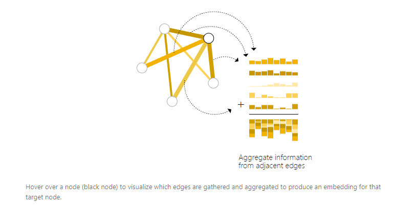

## 1. 图的基本结构

- V：Vertex(or node) attributes

- E:  Edge(or link) attributes and directions

- U:  Global (or master node) attributes

### how to describe these element

- Vertex (or node) embedding
- Edge (or link) attributes and embedding
- Global (or master node) embedding

简单来说，就是将每个元素向量化来进行表示

### two types of graphs

- undirected edge
- directed edge

## 2. 如何将数据表示为图

### 2.1 Image as graphs

我们通常情况下认为图作为一种长方形网格(算上通道也就是三层网格)，我将用(`i*j*3`)的数组形式来表示他们。

另一种表现图片的方式是：每一个像素点代表一个node，并且通过一条边与相邻的像素连接。也就是说每一个非边界像素点都有8个临界点。存储在node中的信息是一个3为的向量，用来代表每个像素点的RGB信息。

我们通过一个邻接矩阵的方式来表示边的连接(第二幅图)

### 2.2 Text as graghs

我们可以将索引关联到每一个字符/词语来序列化文本，并且将文本表示为遗传这些索引。这就建立了一个简单的有向图，在这幅图中每一个单词或者词语是一个节点并通过一条边连接在一起。

******

在通常情况下这些表示方法是冗余的(这些图都是有规律吧的)，可以看的出来图的邻接矩阵是一个带状对角矩阵，而文本的则是一个对角线。

### 2.3 在自然界中图类型数据

- 分子结构
- 人际关系
- 社交图
- 引用图(有向边)

## 3. 图可以定义什么问题

three general types of prediction tasks on graphs

-  graph-level
- node-level
- edge-level

### 3.1 Graph-level task

goal : predict the property of an entire graph.

for a molecule repesented as a graph, we can  predict what the molecule smells like or whether it will bind to a receptor implicated in a disease.

> 简单来说就是对图也就是图表示的物体进行分类或者其他的预测
>
> 举个简单的例子：对于图片可以进行分类，对于文本可以进行情感分析

### 3.2 Node-level task

- predicting the identity or role of each node within a graph

比如上文中的摔跤俱乐部中的连个导师，如果让学生进行战队，那么学生也就是顶点会选择谁。

In this case, distance between a node to either the Instructor or Administrator is highly correlated to this label.

以此类推，Node-level task可以用于图像分割。在图像风格中我们尝试标记每一个像素点。在文本中，可以是预测一个句子中的不同词类

### 3.3 Edge-level task

简单来说就是预测node之间的关系。

如图，在预测了图中的物体之后，我们可以预测物体之间的关系。我们可以将这种表示为边级别的分类。

- 给了node以及它在图片中代表的意义
- 我们希望预测这些node共享了那条边，以及这些边的意义
- 我们可以认为图是完全连接的，之后进行裁剪得到一个稀疏的图

## 4. 挑战

- 如何表示一张图来适配神经网络

图有四种信息可以用来进行预测：nodes,edges,global-context,connectivity

前三种很直观，但是第四种也就是连通性就很复杂。

很显然我们可以使用邻接表，但是这种方式一些缺点。

- the number of nodes in a graph can be on the order of millions, and the number of edges per node can be highly variable

- 这很有可能导致，空间效率低下

另一个问题就是节点的不同的排列产生的效果不一样(如下图所示)

### 3.1 解决方案

一种优雅而高效的方案来表示系数矩阵的图的方法是

- 邻接列表

我们使用一个元组`(i,j)`来描述$e_k$($n_i$和$n_j$之间的边)，同时我们不去存储没有连接的边

> 在此处使用标量来定义顶点和边，当然我们通常使用向量来表示，这对结果没有影响
>
> 如果使用向量的话，就不是一个列表而是一个矩阵比如$[n_{nodes},node_{dim}]$

## 5. 图神经网络

**A GNN is an optimizable transformation on all attributes of the graph (nodes, edges, global-context) that preserves graph symmetries (permutation invariances)**

使用的是message passing neural network,GNN采用*图入，图出*模式，也就是说我们输入一张图，在不改变其连通性的前提下，逐步改变其内部信息，最后输出一张图

### 5.1 最简单的图神经网络

注：这里我们没有使用到连通性

这里我们使用了一个单独的多层感知机(当然也可以使用其他的网络结构在这个图的其他部分)，我们将这一层称为GNN layer。对于节点向量，我们通过MLP得到一个经过优化的节点向量，我已以此类推运用到边以及总体信息上，最后得到一个新的图

我们可以以上步骤来使用多个GNN layers。

经过以上步骤，我们得到了一个和输入结构相同的图(内部信息改变，但是结构不变)

### 5.2 通过池化信息得到GNN的预测结果

我们可以认为本例是一个二分类问题，当然这个结构也可以很简单的扩展为多分类问题或者回归问题。

如果我们的任务是在节点上进行二分类，并且图已经包含了节点的信息，那么我们的方法就是**对每一个节点进行线性回归**

> 注：所有节点使用共享同一个MLP模型！！

然而，实际情况不总是这么简单。比如，你可能在边上存储了一些信息，但是没有在节点上没有信息，但我们需要在节点上进行预测。我们需要一种边上采集信息并交给节点用来预测。此时我们就可以使用pooling（汇聚）。

主要有两个步骤：

- For each item to be pooled, *gather* each of their embeddings and concatenate them into a matrix.
- 我们收集到的矩阵我能通常进行相加从处理

> embedding---嵌入，也就是投影

因此如果我们只有边的特征，在预测顶点的信息时，我们可以使用pooling来将数据传递到我们需要用到的地方

如果我们只有顶点的特征，那么也同理

如果我们只有顶点特征也可以直接预测全图的特征，和全局平均池化层一样

> 注：在之前的例子中，分类模型C可以使用其他不同的模型来代替，或者使用多分类模型。

我们可以将之前这种简单的图模型扩展为复杂的GNN模型，如果有新的特征加入，我们只需要决定如何将信息从一个特征传入另一个特征

**我们需要注意的是**，在这个简单的图模型中，我们没有考虑到它的连通性！！！（连通性简单来说就是在预测边的时候，我们没有考虑其所连顶点之间的关系，而是把边作为单独的一个物体进行预测！！！）这个是不合理的！！

Each node is processed independently。We only use connectivity when pooling information for prediction

### 5.4 Passing messages between parts of the graph

为了让我们在学习的过程中了解图的连通性，我们可以使用message passing(*Neural Message Passing for Quantum Chemistry*),临界的顶点或者边交换信息并且相互影响彼此更新 

> **什么是learned embeddings？**
>
> embedding就是用一个低维的向量表示一个物体，可以是一个词，或是一个商品，或是一个电影等等。这个embedding向量的性质是能使距离相近的向量对应的物体有相近的含义，比如 Embedding(复仇者联盟)和Embedding(钢铁侠)之间的距离就会很接近，但 Embedding(复仇者联盟)和Embedding(乱世佳人)的距离就会远一些。
> 比如，对于这样的“A B A C B F G”的一个序列，也许我们最后能得到：A对应的向量为[0.1 0.6 -0.5]，B对应的向量为[-0.2 0.9 0.7] （此处的数值只用于示意）
>
> 一些论文常见语言：https://zhuanlan.zhihu.com/p/183750490

message passing works in three step

1. For each node in the graph, *gather* all the neighboring node embeddings (or messages), which is the gg function described above.
2. Aggregate all messages via an aggregate function (like sum).
3. All pooled messages are passed through an *update function*, usually a learned neural network.

信息传递技术可以不仅仅可以应用到顶点，边也可以。这是使用图连接性的关键一步。我们在GNN层上建立更多复杂的信息传递变量，来生成更加高效且有效的GNN模型

这和卷积的效果是类似的，我们将邻居的信息进行汇聚。

### 5.5 Learning edge representations

我们的数据集可能不包含所有的信息，之前我们提到过，我们可以通过pooling技术让信息在顶点和边上传递，但我们仅仅再预测的最后一步进行此步骤。我们可以选择再GNN层中通过message passing进行信息的分享

我们用我们之前的方法吸收邻居边的信息，首先我们池化边的信息，使用更新方法进行更新并且存储它。

然而，边和顶点的信息不一定是相同形状的，有两种方法：1. 学习从边到顶点的映射，2. 在更新方法前连接他们

在构建GNN的时候，我们需要决定我们以哪种顺序进行更新图中的不同角色，这是一种开放的领域，当然我们可以使用一种网状的结构where we have four updated representations that get combined into new node and edge representations: node to node (linear), edge to edge (linear), node to edge (edge layer), edge to node (node layer).

### 5.5 添加全局信息

到此处我们还有一个缺陷没有解决：就算我们使用多次信息传递，在途中距离很远的两个顶点不能交换彼此的信息。如果我们7层模型的话，那么我们最多传播7次。这可能会影响到根据距离很远的两个点上的预测值。一个解决方案是我们可以让所有的node能够彼此传递信息。但是这样很快就会让计算变得困难。

另一个方法通过使用图的全局表示(master node或context vector),context vector连接着所有的顶点和边，并且连接网络中其他所有的边和顶点同时可以作为两个物体之间交流的桥梁。这就创造了一个更加丰富且复杂的图的表示

For example, for one node we can consider information from neighboring nodes, connected edges and the global information .To condition the new node embedding on all these possible sources of information, we can simply concatenate them. Additionally we may also map them to the same space via a linear map and add them or apply a feature-wise modulation layer, which an be considered a type of featurize-wise attention mechanism.

## 6. GNN Playground

https://distill.pub/2021/gnn-intro/

## 7. Some empirical GNN design lessons

- 样本量越多，模型的效果越好

- 对于图中不同的元素的预测效果

> 中间较宽的部分是25和75的分位数

我们可以发现higher dimensionality 有更好的平均值以及下界，但是与最大值无关。

- GNN层数

mean随着层数的增加而增加，但是层数高了对于其他参数也需要进行优化

- aggregation operation

没有太大的区别

- the style of message passing

the more graph attributes are communicating, the better the performance of the average model.

## 8. 相关技术

### 8.1 Other types of graphs

**Multigraph**

 a pair of nodes can share multiple types of edges, this happens when we want to model the interactions between nodes differently based on their type。

比如在关系网络中，我们可以根据不同的关系来使用不同的边

**nested graphs**

for example a node represents a graph, also called a hypernode graph。Nested graphs are useful for representing hierarchical information. For example, we can consider a network of molecules, where a node represents a molecule and an edge is shared between two molecules if we have a way (reaction) of transforming one to the other

**hypergraph**

### 8.2 Sampling Graphs and Batching in GNNs

在深度学习中使用梯度计算是很正常的一部，但是因为参数的可变性，我们无法得到一个固定的batch size。解决方案之一就是，创建子图来保存大图上基础的属性。这张图的抽样很大程度上依赖上下文。在有些预测中这点很重要，但是在有些方面也不是很重要。

如果我们关注维持原本的邻居结构，一种方法就是随机固定数量的采样，然后添加邻接的节点和边，每个邻居可以看作一个独立的图并且GNN可以训练这些子图，同时损失函数可以只考虑当前的node集合。

另一种更加高效的方法是，先随机采样一个顶点，然后扩充K距离的顶点。之后采样其他节点使用相同的策略。

Sampling a graph is particularly relevant when a graph is large enough that it cannot be fit in memory

### 8.3 归纳假设

图的归纳假设基于图的对称性

A model should preserve explicit relationships between entities (adjacency matrix) and preserve graph symmetries (permutation invariance)

### 8.4 比较汇聚操作

Pooling information is a critical step.

The mean operation can be useful when nodes have a highly-variable number of neighbors or you need a normalized view of the features of a local neighborhood. The max operation can be useful when you want to highlight single salient features in local neighborhoods. Sum provides a balance between these two, by providing a snapshot of the local distribution of features, but because it is not normalized, can also highlight outliers. In practice, **sum is commonly used**.

### 8.5 GCN as subgraph function approximators

GCN : 图卷积神经网络

GCN (and MPNN) of k-layers with a 1-degree neighbor lookup is as a neural network that operates on learned embeddings of subgraphs of size k。

So a GCN is collecting all possible subgraphs of size k and learning vector representations from the vantage point of one node or edge. 

### 8.6 Edges and the Graph Dual

### 8.7 Graph convolutions as matrix multiplications, and matrix multiplications as walks on a graph

没看懂

### 8.8 Graph Attention Networks

卷积是对位置敏感的，在图中我们需要对位置不敏感，此处可以引入注意力机制，权重取决于顶点向量之间的关系(可以看看transform)--graph attention network

### 8.9 Graph explanations and attributions

### 8.10 Generative modelling

> - 视频
>
> https://www.bilibili.com/video/BV1iT4y1d7zP/?spm_id_from=333.337.search-card.all.click&vd_source=8beb74be6b19124f110600d2ce0f3957
>
> - 对应的blog
>
> https://distill.pub/2021/gnn-intro/