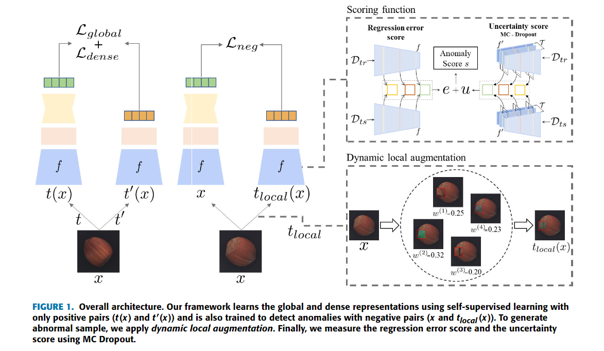

### 自监督学习法

主要有两种方法：

The pretext task通常采取许多不同的形式，但其全部归结为预测或恢复输入图像中的隐藏区域或属性。近来基于SSL的AL方法依赖于三个主要代理任务：图像修复、相对位置预测和属性恢复。

#### 1. 图像修复是最常见的代理任务

总体来说和之前的重建任务是类似的。只是名称上不同。

合成缺陷图像的常见方法：

#### 1. 代理任务

1. 随机噪声，修复这类随机噪声的模型也被称为去噪编码器。之后有人提出，随机擦除正常样本中任意形状的区域，然后用固定颜色填充，来扩充样本的数量。（随机噪声其实还不错）。然而，这种设计没有考虑图像中存在的便于后续网络恢复的结构信息。也就是没有学习到结构性特征，(只学到了纹理特征)。因此https://www.sciencedirect.com/science/article/abs/pii/S0031320320305094使用了网状随机掩码的方式来学习结构信息

   

   掩码的区域的数量和大小是被参数化的方便控制。之后提出了多尺度的随机大跨度条状掩码[Learning semantic context from normal samples for unsupervised anomaly detection](https://ojs.aaai.org/index.php/AAAI/article/view/16420)

   

   猜测注意：原文是用来做布料检测的，**可以很好的学习当方向的纹理信息！！！**

   之后开始使用类似与真实情况的异常点，一种方法是首先在原始无缺陷图像上裁剪该区域，然后将其以随机角度粘贴到图像上，形成新的异常图像。还有些方法使用背景融合的方式其中通过选择不同的背景图像、改变大小、亮度和形状来模拟缺陷

   

   从理论上讲，越接近真实的合成缺陷的效果，图像重建和恢复能力就越具有可推广性。但在真实的场景中，缺陷的类型和形状往往不可预测，因此很难决定哪种合成方法是最优的。但是缺陷的真实性和效果没有相关性，需要配合合适的网络

2. 相对位置预测

   最经典的文章---自监督的特征提取方法

   https://paperswithcode.com/paper/patch-svdd-patch-level-svdd-for-anomaly

   首相将图片分为`3*3`patch的区域,并对中心周围区域的8个块进行排序

   

   然后训练该模型的编码器提取信息特征，使后续分类器能够正确预测斑块的相对位置。

   

   **但是这种结果会很粗糙。**

   https://paperswithcode.com/paper/inpainting-transformer-for-anomaly-detection提出了一种通过周围图像来恢复中心图像的模型

   

   https://paperswithcode.com/paper/self-supervised-predictive-convolutional

   Ristea等人[101]为AL设计了自监督预测卷积注意块（SSPCAB）。对于应用扩张卷积滤波器的每个位置，块学习使用上下文信息来重构掩蔽区域。

   

   **这个模型的效果很好！！！，在异常检测方面的排名都在前5**

3. Attribute restoration is characterized by using hidden attributes in the image rather than masked areas

   https://ieeexplore.ieee.org/abstract/document/9311201
   
   
   
   提出了一种属性恢复网络，将传统的重构任务转化为恢复任务。首先它改变输入图片的属性特征如移除颜色，改变方向，然后放入AE网络来进行恢复。
   
   https://ieeexplore.ieee.org/abstract/document/9179311
   
   
   
   
   
   提出了一种裂脑CAE方法来检测和定位缺陷，使用两个不相交的CAE网络从图像的子通道预测另一子通道。每个编码器实现不同颜色通道之间的转换。该设计充分利用了图像的颜色特性，提高了异常图像的定位精度。

#### 2. 对比学习

代理任务主要关注于在像素级别上产生与训练图像相似的图片，另一个改进是学习相似实例之间的共同特征并区分不相似实例之间的差异。

https://arxiv.org/abs/1807.03748

https://arxiv.org/abs/2107.07820

将图片分成多个patch，每行patch作为一个步长，在测试阶段，将测试图像块与无缺陷图像中随机选择的图像块进行比较，以计算对比度损失函数，即InfoNCE。当超过一定阈值时，当前图像块被判定为异常区域。结果，该方法由于基于块的操作而影响检测效率，并且其定位精度不高。

https://openaccess.thecvf.com/content/CVPR2021/html/Chen_Exploring_Simple_Siamese_Representation_Learning_CVPR_2021_paper.html

它输入相同特征的两个随机变换的结果，使用相同的编码器f提取特征，并将它们变换到更高维空间。使用预测器g，其变换分支之一的结果并将其与另一分支的结果匹配。该方法充分利用了Siamese网络的自然建模不变性。

https://ieeexplore.ieee.org/abstract/document/9597511

用自监督模块代替原始预测器。

http://proceedings.mlr.press/v119/chen20j.html

提出了一种基于简单框架的视觉表征对比学习的人工学习方法

https://github.com/google-research/simclr

#### 3. 基于单分类的方法

AD任务

https://paperswithcode.com/paper/drocc-deep-robust-one-class-classification

训练网络，然后将训练数据映射到特征空间中的小超球。超球之外的数据称为异常。

AL任务

基于一类分类的方法通过将图像划分为块并将块分类为异常或正常类别来定位异常区域，结果一般很粗略

https://ieeexplore.ieee.org/abstract/document/8895110

同时使用到了GAN

https://ipsjcva.springeropen.com/articles/10.1186/s41074-019-0056-0

> SVDD https://blog.csdn.net/Compile666/article/details/115544463

https://sci-hubtw.hkvisa.net/10.1109/icme51207.2021.9428370

FCDD：SVDD结合热力图

