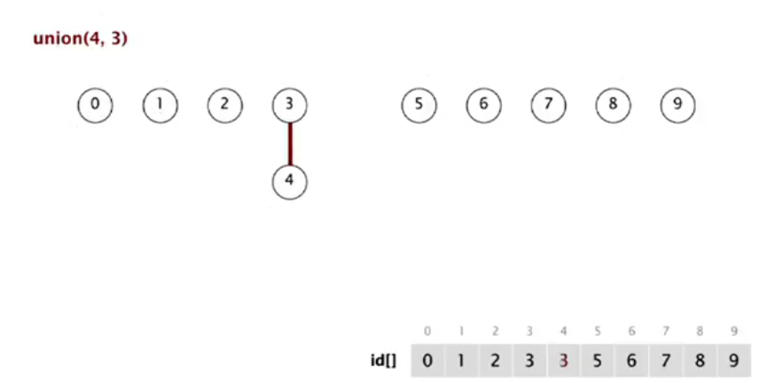

# quick-union算法

懒策略：我们尽可能避免计算直到不得不计算

我们将之前的数组看作多个树如下图所示


现在每一个元素都有根节点或者是一个根节点，同时所有根节点都是不想连的

 这时候如何find ： check if p and q have the same root

union : to merge components containing p and q, set the id of p's root to the id of q's root

此时union操作的过程就十分简单,find操作就会稍微复杂



```python
public class QuickUnionUF {

    private int[] id;

    public  QuickUnionUF(int N){
        id = new int[N];
        for (int i = 0; i < N; i++) {
            id[i] = i;
        }
    }

    private int root(int i){
        while(i!=id[i]) i= id[i];
        return  i;
    }
    public boolean connected(int p , int q){
        return root(p) == root(q);
    }

    public void union(int p , int q){
        int pRoot = root(p);
        int qRoot = root(q);
        if(pRoot == qRoot ) return;
        id[pRoot] = qRoot;//此时components的数量减一

    }

}

```

### 算法分析

