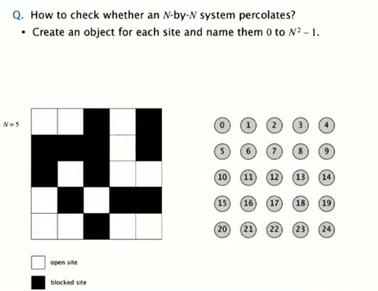
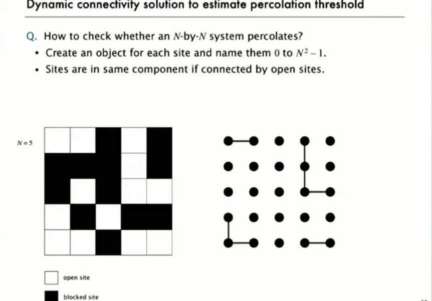
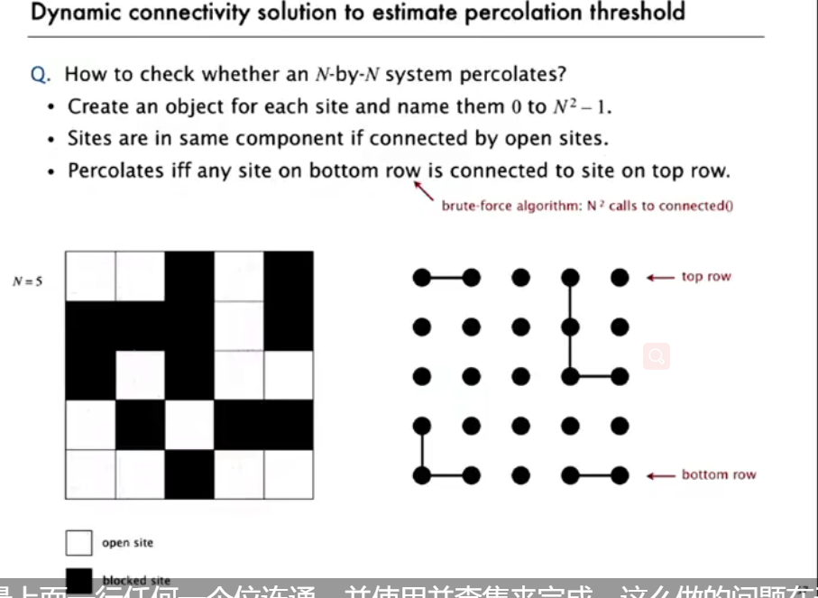
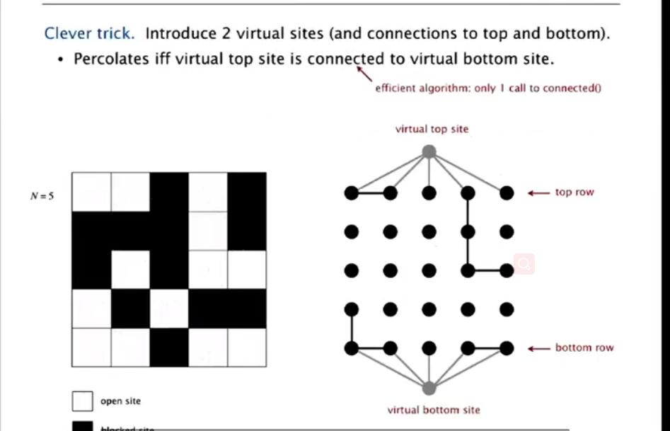

## percolation

a model of many physical systems:

- N-by-N grid of sites
- each site is open with probarility p (or blocked with probability 1-p)
- system percolaties iff top and bottom are connected by open sites

这可以应用到很多地方，比如水是否可以流下来，以及人际关系网络中是否可以联通

